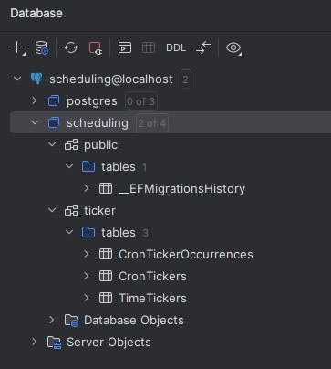
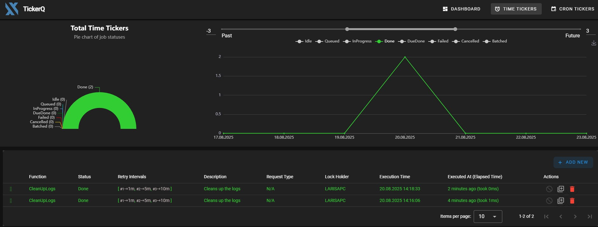
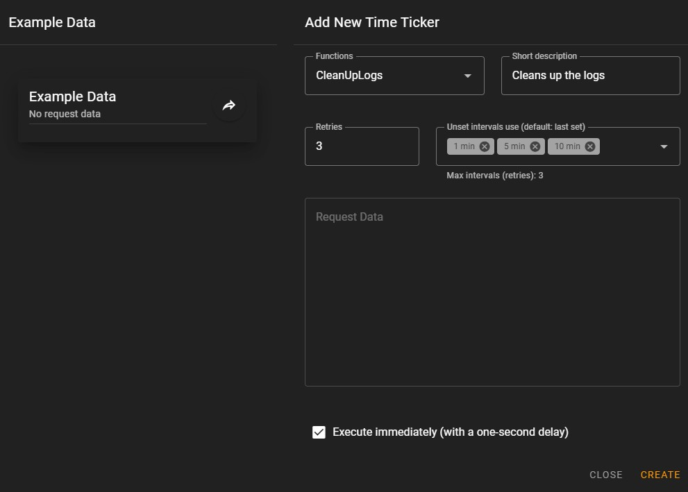
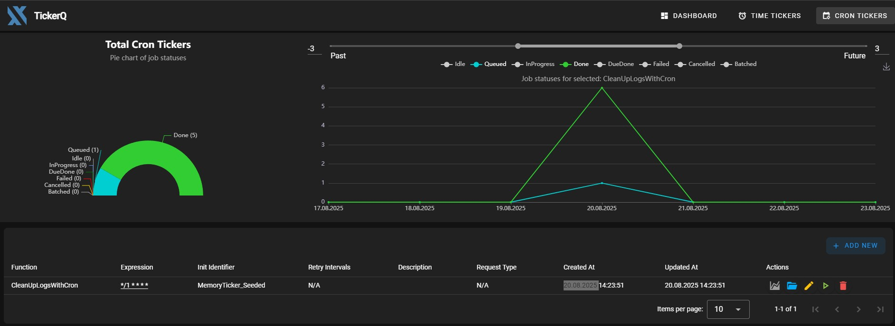
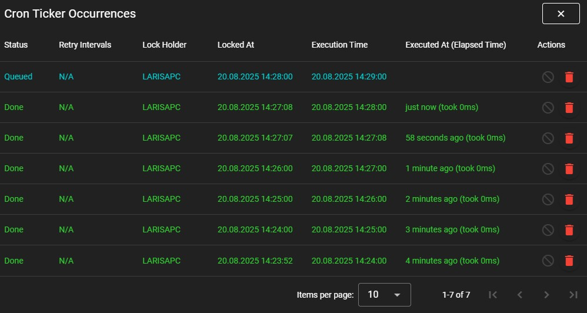
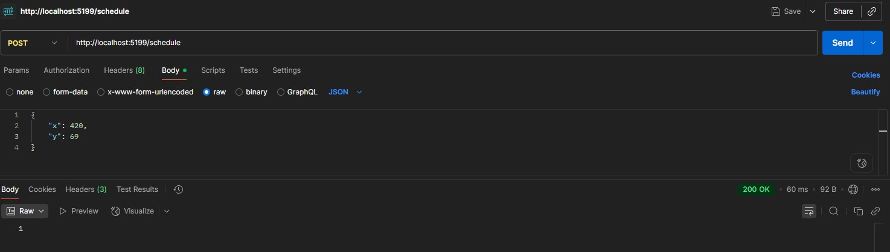

### GetUser
To run existing profile:
`dotnet run --launch-profile="https"`

### User.Api.Scheduler
* Added a new project to demo `TickerQ` nuget package that can easily spin up jobs, cron jobs and represent them in a nice and reactive dashboard
* First, add the package to the project
* It needs a db for scheduled jobs to be run and tracked
* Run migration when db context is being set
```
dotnet ef migrations add "TickerQInitialCreate" -c MyDbContext
```
* And apply that to the db:
```
dotnet ef database update TickerQInitialCreate
```
* After migration is run, there should be a new table in the database

* When we go to the dashboard http://localhost:5199/tickerq

* The jobs could be created and run directly from the dashboard

* If the job has an object to pass, the exmaple will be in the left corner and you can add that to the run
* Another tag is for cron jobs

* Cron job history

* There is an option to create an endpoint that will be created by calling it
